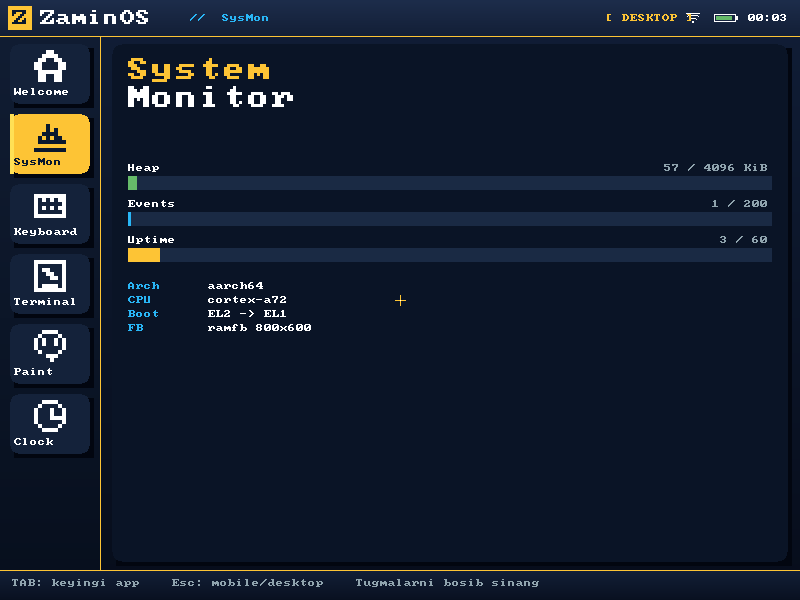
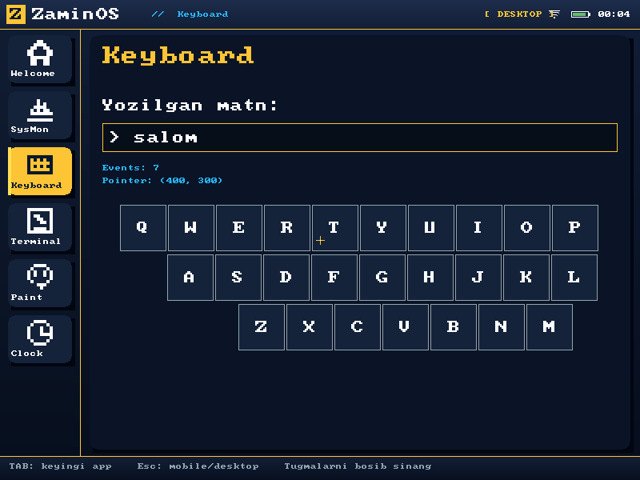
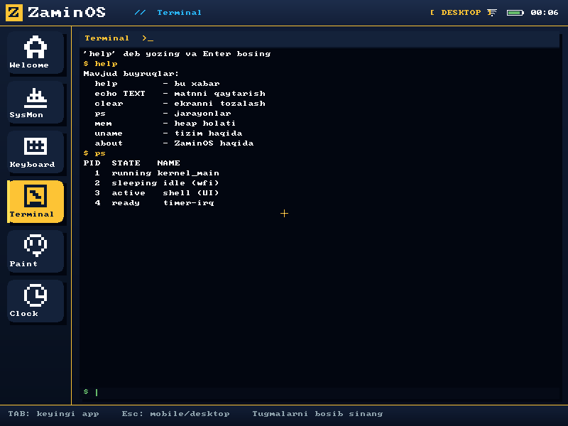
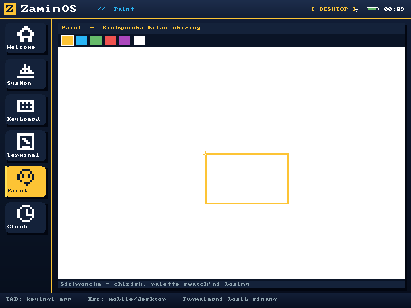
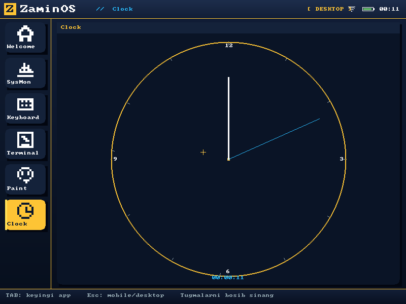
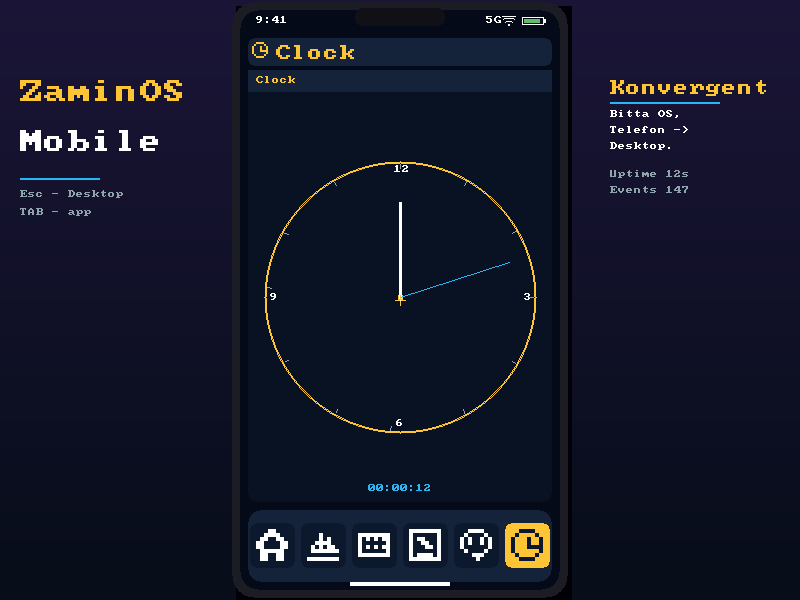
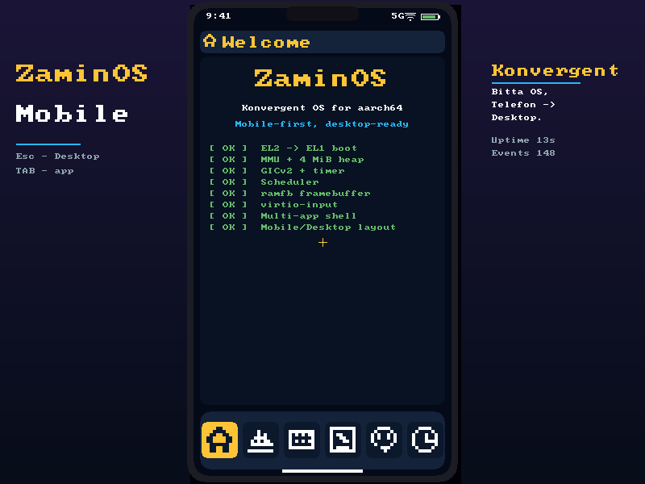

# ZaminOS

ARM **aarch64** chiplariga moʻljallangan, **Rust** tilida yozilayotgan operatsion tizim. Asosiy maqsad — **mobile-first**, lekin tashqi monitor + klaviatura + sichqoncha ulanganda **desktop** rejimida ishlay oladigan **konvergent** OS.

> Holati: **Faza 0–7 yakunlandi.** To'liq konvergent shell — 6 ta app (Welcome, SysMon, Keyboard, Terminal, Paint, Clock), gradiyent fonlar, yumaloq panellar, vizual app ikonalari, status bar (wifi/batareya/soat). Esc bilan **Mobile** rejimga o'tish — telefon shakli, notch, dock.

### Desktop rejimi

| Welcome | SysMon | Keyboard |
|---|---|---|
|  |  |  |
| **Terminal** | **Paint** | **Clock** |
|  |  |  |

### Mobile rejimi (Esc bilan)

| Mobile / Clock | Mobile / Welcome |
|---|---|
|  |  |

## Yoʻl xaritasi

- [x] **Faza 0** — Toolchain, skelet, QEMU virt boot
- [x] **Faza 1** — PL011 UART, `println!` makros
- [x] **Faza 2** — MMU (39-bit VA, 1 GiB blok identity map), 4 MiB heap allokator
- [x] **Faza 3** — Exception vector, GICv2, ARM generic timer (1 Hz)
- [x] **Faza 4** — Kooperativ scheduler (round-robin task'lar)
- [x] **Faza 5** — ramfb framebuffer (800×600 XRGB8888), 8×8 font matn rendering
- [x] **Faza 6** — virtio-input (klaviatura + tablet/sichqoncha), live event loop, dirty-flag redraw
- [x] **Faza 6.5** — Konvergent shell: top bar + side launcher + main content area, TAB bilan almashish
- [x] **Faza 7** — 6 ta app: Welcome, SysMon (gauges), Keyboard (visual QWERTY), Terminal (REPL: help/echo/clear/ps/mem/uname/about), Paint (Bresenham strokes), Clock (analog dial). Mobile/Desktop layout (Esc bilan). Gradiyent wallpaper, yumaloq panellar, soyalar, real grafik app ikonalari, wifi/batareya status ikonalari.
- [ ] **Faza 7** — Raspberry Pi 4/5 portlash
- [ ] **Faza 8** — Userspace, ELF loader, syscalls
- [ ] **Faza 9** — Adaptiv shell va GUI (mobile ↔ desktop konvergensiyasi)

## Talablar

```bash
# Rust nightly + aarch64 bare-metal target
rustup toolchain install nightly --component rust-src llvm-tools-preview
rustup target add aarch64-unknown-none-softfloat --toolchain nightly
cargo install cargo-binutils

# Tizim paketlari (Ubuntu/Debian)
sudo apt install -y qemu-system-arm gcc-aarch64-linux-gnu binutils-aarch64-linux-gnu
```

## Qurish va ishga tushirish

```bash
make build       # debug build
make run         # QEMU virt da ishga tushirish (UART konsol)
make debug       # QEMU + gdb stub (port 1234)
make screenshot  # headless QEMU + framebuffer skrinshot (dist/screenshot.png)
make ios         # iPhone (UTM SE) uchun image tayyorlash
make clean
```

### iPhone'da sinab ko'rish (UTM SE)

```bash
make ios
# Natija: dist/zaminos-kernel.bin — UTM SE'ga yuklang
```

To'liq qo'llanma: [`dist/README-iOS.md`](dist/README-iOS.md)

Chiqishi:

```
==============================================
 ZaminOS v0.1.0  —  aarch64 Rust kernel
 Salom, dunyo! Yadro muvaffaqiyatli yuklandi.
==============================================

[boot] CPU: cortex-a72 (QEMU virt)
[boot] UART: PL011 @ 0x09000000
[boot] Faza 0 + 1 OK. Faza 2 (MMU) keyingi qadam.

[idle] Yadro idle tsiklga o'tdi (wfe).
```

QEMU dan chiqish: `Ctrl-A`, keyin `x`.

## Tuzilma

```
ZaminOS/
├── Cargo.toml              # workspace
├── rust-toolchain.toml     # nightly pin
├── Makefile                # build/run/debug
├── .cargo/config.toml      # target, rustflags, build-std
└── kernel/
    ├── Cargo.toml
    ├── linker.ld           # 0x40000000 (QEMU virt)
    └── src/
        ├── main.rs         # kernel_main
        ├── boot.S          # _start, BSS, stack
        ├── panic.rs
        ├── console.rs      # print!/println! makroslari
        └── drivers/
            └── uart_pl011.rs
```

## Litsenziya

LICENSE faylida koʻrsatilgan.
